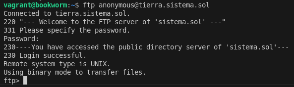
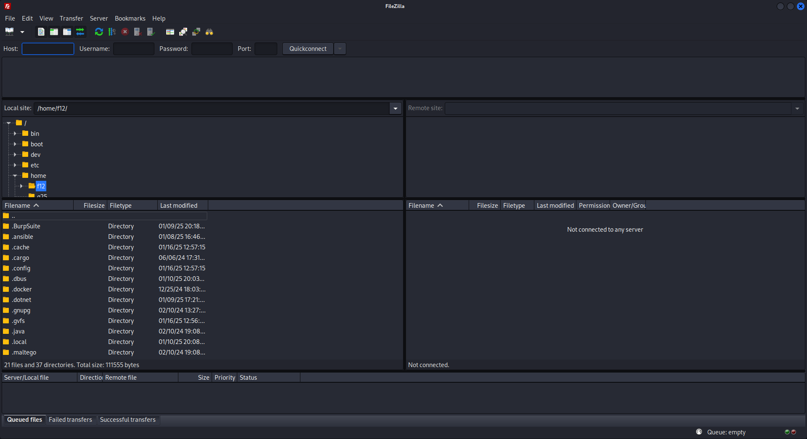

= Configuración de vsftpd.conf

Este archivo README explica las configuraciones del archivo `vsftpd.conf` que es usado para configurar el servidor *vsftpd* (Very Secure FTP Daemon), un servidor FTP ligero y seguro.

== 1. Archivo vsftpd.conf

Este archivo contiene una configuración personalizada y avanzada para un servidor FTP en el dominio `sistema.sol`.

=== Principales configuraciones:

==== 1. Modo de operación del servidor:
- `listen=YES`: Configura el servidor como independiente (standalone) y lo habilita para conexiones IPv4.
- `listen_ipv6=NO`: No habilita soporte para IPv6 en esta configuración.

==== 2. Mensajes personalizados:
- `ftpd_banner="--- Welcome to the FTP server of 'sistema.sol' ---"`: Mensaje de bienvenida al conectarse.
- `dirmessage_enable=YES`: Activa mensajes personalizados en directorios (archivos `.message`).

==== 3. Permitir usuarios anónimos y configuraciones:
- `anonymous_enable=YES`: Permite acceso anónimo.
- `anon_upload_enable=NO`: No permite a usuarios anónimos subir archivos.
- `anon_other_write_enable=NO`: No permite a usuarios anónimos realizar modificaciones (el acceso es solo de lectura).

==== 4. Control de usuarios locales:
- `local_enable=YES`: Permite el acceso a usuarios locales.
- `write_enable=YES`: Permite a los usuarios locales subir y modificar archivos.
- `chroot_local_user=YES`: Enjaula a los usuarios locales en sus directorios personales.
- `chroot_list_enable=YES`: Excluye de la restricción a usuarios listados en `/etc/vsftpd.chroot_list`.

==== 5. Restricciones de ancho de banda y conexiones:
- `local_max_rate=5242880`: Límite de velocidad para usuarios locales (5 MB/s).
- `anon_max_rate=2097152`: Límite de velocidad para usuarios anónimos (2 MB/s).
- `max_clients=15`: Máximo de 15 clientes conectados simultáneamente.

==== 6. Tiempo de espera:
- `idle_session_timeout=720`: Cierra la sesión tras 720 segundos de inactividad.

==== 7. Configuración de seguridad (FTPS):
- `ssl_enable=YES`: Habilita FTPS (FTP con SSL/TLS).
- `force_local_data_ssl=YES` y `force_local_logins_ssl=YES`: Obliga a que todas las conexiones locales sean cifradas.
- `rsa_cert_file` y `rsa_private_key_file`: Especifica los certificados SSL utilizados.

== Configuración de vsftpd

=== Comprobación del servidor creado

==== Paso 1: Configuración inicial en FileZilla, ingresando el servidor, nombre de usuario y puerto.

==== Paso 2: Confirmación del certificado del servidor, verificando la autenticidad y aceptándolo.

image::../images/vstfpdinfo/2.png[Paso 2]

==== Paso 3: Transferencia exitosa de un archivo desde el servidor remoto al cliente local.

image::../images/vstfpdinfo/3.png[Paso 3]

==== Paso 4: Conexión al servidor FTP con credenciales específicas.

image::../images/vstfpdinfo/4.png[Paso 4]

==== Paso 5: Uso de la terminal para conectarse al servidor FTP como usuario `luis` y listar los archivos disponibles.

image::../images/vstfpdinfo/5.png[Paso 5]

==== Paso 6: Conexión al servidor FTP como usuario `maria`, navegando entre directorios y listando carpetas.

image::../images/vstfpdinfo/6.png[Paso 6]

==== Paso 7: Conexión al servidor FTP en modo anónimo, mostrando acceso limitado a los directorios públicos.

image::../images/vstfpdinfo/7.png[Paso 7]

=== 2. Uso y propósito de los archivos:

- *vsftpd.conf*: Archivo personalizado para un entorno productivo en el servidor de `sistema.sol`.
- *vsftpd.conf.bak*: Archivo de respaldo con configuraciones predeterminadas, útiles para entender las opciones básicas y como referencia para crear una configuración propia.

=== 3. Cómo usar estos archivos:

==== 1. Configurar `vsftpd.conf`:
1. Copiar el archivo en `/etc/vsftpd.conf`.
2. Ajustar las rutas de los certificados (`rsa_cert_file` y `rsa_private_key_file`) si difieren en tu sistema.
3. Crear o editar `/etc/vsftpd.chroot_list` para definir usuarios excluidos del enjaulamiento.

==== 2. Revertir a `vsftpd.conf.bak`:
. Usar este archivo como plantilla básica para restaurar una configuración mínima.
. Renombrarlo como `vsftpd.conf` y adaptarlo según sea necesario.
. Recomendaciones de seguridad:
- Usar FTPS siempre que sea posible (`ssl_enable=YES`).
- Limitar el acceso anónimo a solo lectura o deshabilitarlo por completo.
- Usar listas de control (`chroot_list_enable=YES`) para definir excepciones de acceso.

=== 3. Comandos útiles:

==== Iniciar/Detener/Restaurar el servicio:
[source,bash]
----
sudo systemctl start vsftpd
sudo systemctl stop vsftpd
sudo systemctl restart vsftpd
----

==== Verificar estado del servicio:

[source,bash]
----
sudo systemctl status vsftpd
----

==== Probar la conexión FTP:

[source,bash]
----
ftp localhost
----

== Ejercicio 2.2

=== 1. Verificar si pftp está instalado

==== Comando para verificar si está instalado:
[source,bash]
----
which pftp
----
- Si el comando muestra una ruta como `/usr/bin/pftp`, significa que está instalado.
- Si no está instalado, el comando no devolverá ningún resultado.

==== Instalar pftp si no está instalado:

En sistemas basados en Debian/Ubuntu:
[source,bash]
----
sudo apt update
sudo apt install ftp
----

=== 2. Configurar el archivo `~/.netrc` para conexiones automáticas

. *Crear o editar el archivo `~/.netrc`:*

    nano ~/.netrc

. *Agregar la configuración de un servidor FTP:*

    Escribe en el archivo la siguiente estructura para cada servidor al que quieras conectarte:
    
    machine <nombre_del_servidor>
    login <usuario>
    password <contraseña>
    
. *Guardar y salir del archivo:*

    - En **nano**, presiona:
    - `Ctrl + O` para guardar los cambios.
    - Luego, presiona `Enter` para confirmar.
    - Finalmente, `Ctrl + X` para salir.

. *Asegurar que el archivo tiene permisos restringidos (seguridad):*

    Ejecuta el siguiente comando para garantizar que solo el propietario pueda acceder al archivo:

    chmod 600 ~/.netrc

=== 3. Probar la conexión automática

Después de configurar el archivo `~/.netrc`, puedes conectarte automáticamente al servidor sin ingresar credenciales manualmente.

==== Usar pftp:
[source,bash]
----
pftp tierra.sistema.sol
----

== Ejericio 2.3

=== 1. Establecer conexión anónima al servidor `ftp.cica.es` desde `tierra.sistema.sol`

Usa el comando `ftp` para conectarte de forma anónima:
[source,bash]
----
ftp ftp.cica.es
----

=== 2. Examinar el directorio actual en el servidor

Después de conectarte al servidor, utiliza el siguiente comando para ver el directorio actual:
[source,bash]
----
pwd
----

=== 3. Examinar el directorio actual en el cliente

Para ver el directorio actual del cliente (tu máquina local) mientras estás conectado al servidor FTP, usa:
[source,bash]
----
!pwd
----

=== 4. Listar los archivos en el servidor

Para ver los archivos y carpetas en el directorio actual del servidor FTP, utiliza:
[source,bash]
----
ls
----

=== 5. Listar los archivos en el cliente

Para listar los archivos en el directorio actual de tu máquina local (cliente) mientras estás conectado al servidor FTP, usa:
[source,bash]
----
!ls
----

=== 6. Descargar `/pub/check` del servidor al cliente

Usa el comando `get` para descargar un archivo desde el servidor FTP a tu máquina local:
[source,bash]
----
cd /pub
get check
----

=== 7. Crear el directorio imágenes en el cliente dentro de pruebasFTP

Para crear un directorio en el cliente:

. Sal de la sesión FTP temporalmente con `!`:

    !mkdir -p pruebasFTP/imágenes

. Confirma que se creó el directorio usando:

    !ls pruebasFTP

=== 8. Subir el archivo datos1.txt al servidor

Asegúrate de que el archivo `datos1.txt` exista en el cliente. Luego, usa el comando `put` para subirlo al servidor:
[source,bash]
----
put datos1.txt
----

=== 9. Cerrar la conexión

Para salir de la sesión FTP, usa:
[source,bash]
----
bye
----

== Uso de Cliente Gráfico para FTP

=== Paso 1: Abrir FileZilla

Comando para instalar FileZilla en sistemas basados en Debian/Ubuntu. Usa el comando `sudo apt install filezilla`.

== Paso 2: Interfaz inicial de FileZilla
Al abrir FileZilla, verás la interfaz inicial donde podrás configurar los parámetros para conectar a un servidor FTP.

image::../images/gráfico/2.png[Paso 2]

== Paso 3: Configuración de un nuevo sitio FTP
Para configurar un nuevo sitio FTP en FileZilla, ingresa el host (`ftp.rediris.es`), selecciona el tipo de cifrado y habilita el acceso anónimo si es necesario.

== Paso 4: Advertencia sobre conexión insegura
Al conectar al servidor, FileZilla mostrará una advertencia sobre el uso de FTP sin cifrado (inseguro). Si es necesario, puedes aceptar y continuar con la conexión.

== Paso 5: Estado de la conexión al servidor
El estado de la conexión al servidor FTP se verifica y se muestra que la conexión ha sido exitosa.

image::../images/gráfico/5.png[Paso 5]

== Paso 6: Transferencia de archivos desde el cliente
En este paso, se transfiere un archivo (`welcome.msg`) desde el servidor FTP a tu cliente local.

image::../images/gráfico/6.png[Paso 6]

== Paso 7: Exploración de los archivos en el cliente
Después de la transferencia, el archivo (`welcome.msg`) aparece en tu sistema local y se puede abrir en un editor de texto.

image::../images/gráfico/7.png[Paso 7]

== Paso 8: Navegación en los directorios del cliente y servidor
Aquí puedes ver la vista comparativa de los directorios locales y remotos en FileZilla, destacando la transferencia completada.

image::../images/gráfico/8.png[Paso 8]

== Paso 9: Servicios reiniciados en el sistema
En esta imagen, se muestran los servicios que se reinician después de la instalación o actualización del software.

image::../images/gráfico/9.png[Paso 9]

== Paso 10: Resultado final
El proceso finaliza con éxito, mostrando que FileZilla está configurado y listo para gestionar conexiones FTP.

image::../images/gráfico/10.png[Paso 10]

== Preguntas

=== a. ¿Qué modo ha usado el cliente (activo o pasivo) al descargar el listado de archivos del servidor?
FileZilla, por defecto, utiliza el *modo pasivo* para las conexiones FTP. En este modo, el cliente inicia la conexión tanto para los comandos como para la transferencia de datos, lo cual es útil cuando hay cortafuegos o routers NAT en el camino.

=== b. ¿Cuál es la IP del servidor de ftp.rediris.es?
La IP del servidor `ftp.rediris.es` es *130.206.13.2*.

=== c. ¿De los 6 dígitos que aparecen en el mensaje 227 "Entering Passive Mode (…) qué significan los 2 últimos números?
En el mensaje *227 Entering Passive Mode (192,0,2,1,104,31)*, los dos últimos números *104* y *31* representan el puerto remoto para la conexión de datos pasiva. Estos números corresponden al puerto *(104 * 256 + 31 = 26719)*, que es el puerto utilizado para la transferencia de datos en modo pasivo.