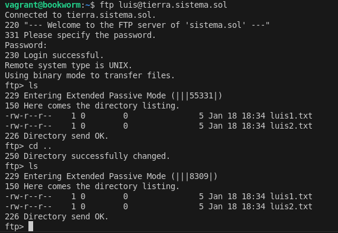

Esta carpeta es para tomar capturas y luego pasarlas a la documentación dicha información.

Llamar las fotos por orden: 1 , 2 ...

También se resuelven preguntas para el vsftpd

# Configuración de vsftpd

## Imágenes y pasos

### Paso 1

-  Configuración inicial en FileZilla, ingresando el servidor, nombre de usuario y puerto.

---

### Paso 2

-  Confirmación del certificado del servidor, verificando la autenticidad y aceptándolo.

---

### Paso 3

-  Transferencia exitosa de un archivo desde el servidor remoto al cliente local.

---

### Paso 4

-  Conexión al servidor FTP con credenciales específicas.

---

### Paso 5

-  Uso de la terminal para conectarse al servidor FTP como usuario `luis` y listar los archivos disponibles.

---

### Paso 6

-  Conexión al servidor FTP como usuario `maria`, navegando entre directorios y listando carpetas.

---

### Paso 7

-  Conexión al servidor FTP en modo anónimo, mostrando acceso limitado a los directorios públicos.

