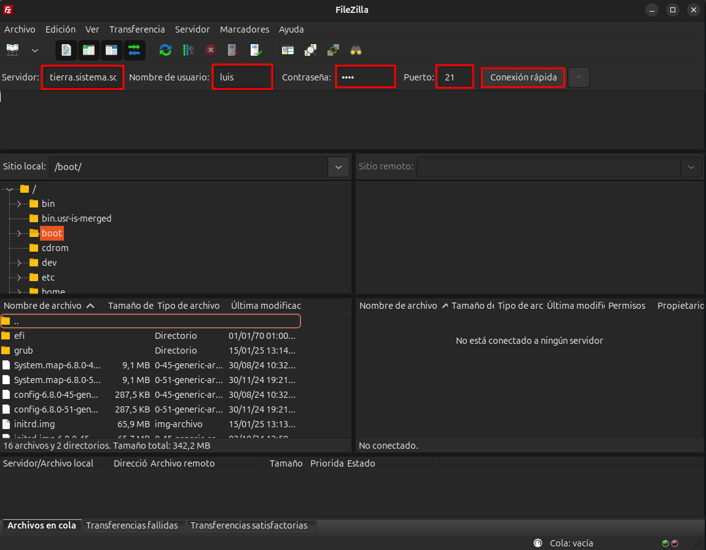
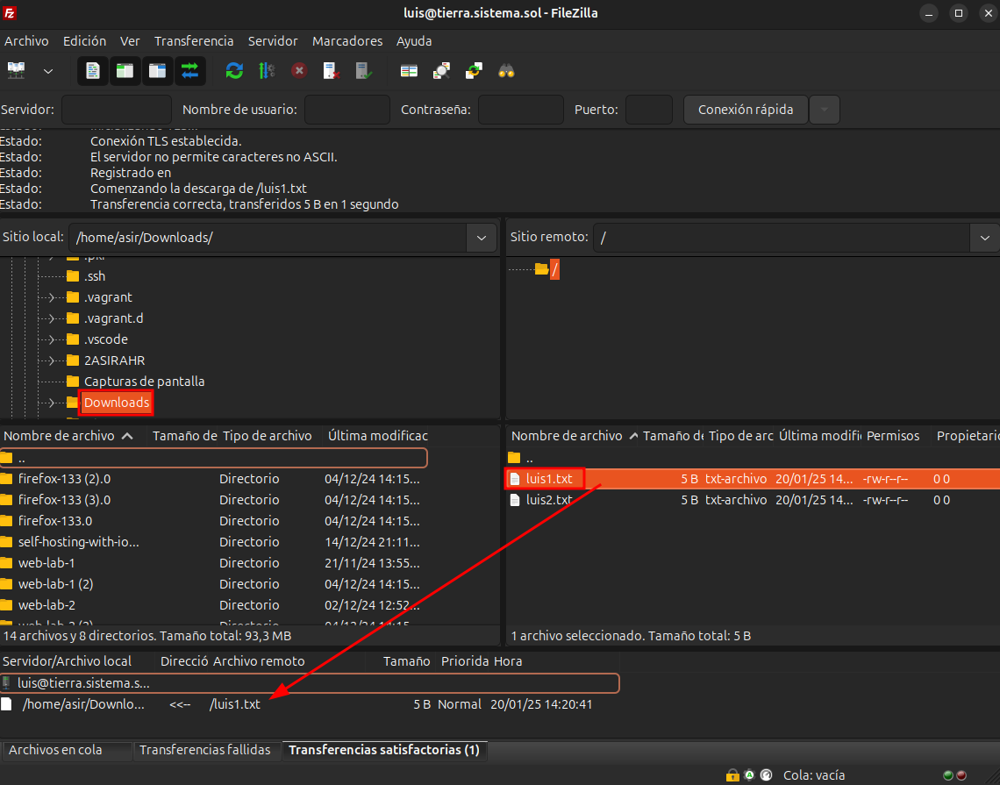
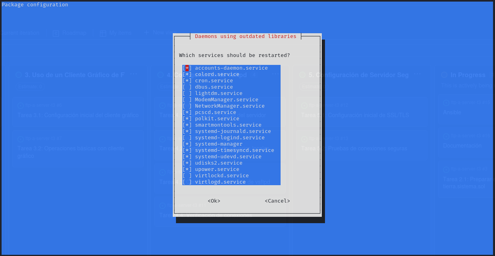
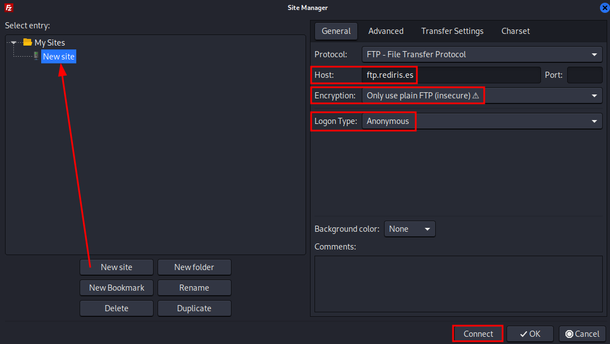
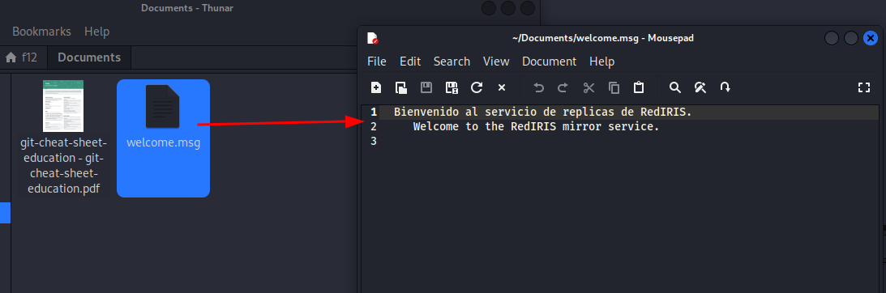

Esta carpeta es para tomar capturas y luego pasarlas a la documentación dicha información.

Llamar las fotos por orden: 1 , 2 ...

También se resuelven preguntas para el vsftpd

# Configuración de vsftpd

## Imágenes y pasos

### Paso 1

-  Configuración inicial en FileZilla, ingresando el servidor, nombre de usuario y puerto.

---

### Paso 2

-  Confirmación del certificado del servidor, verificando la autenticidad y aceptándolo.

---

### Paso 3

-  Transferencia exitosa de un archivo desde el servidor remoto al cliente local.

---

### Paso 4

-  Conexión al servidor FTP con credenciales específicas.

---

### Paso 5

-  Uso de la terminal para conectarse al servidor FTP como usuario `luis` y listar los archivos disponibles.

---

### Paso 6

-  Conexión al servidor FTP como usuario `maria`, navegando entre directorios y listando carpetas.

---

### Paso 7

-  Conexión al servidor FTP en modo anónimo, mostrando acceso limitado a los directorios públicos.

# Uso de Cliente Gráfico para FTP
### Paso 1: Abrir FileZilla

-  Comando para instalar FileZilla en sistemas basados en Debian/Ubuntu. Usa el comando `sudo apt install filezilla`.

---

### Paso 2: Interfaz inicial de FileZilla

-  Interfaz inicial de FileZilla al abrir el programa. Aquí se pueden configurar los parámetros para conectar a un servidor FTP.

---

### Paso 3: Configuración de un nuevo sitio FTP

-  Creación de un nuevo sitio FTP en FileZilla, configurando el host (`ftp.rediris.es`), tipo de cifrado y acceso anónimo.

---

### Paso 4: Advertencia sobre conexión insegura

-  Al conectar al servidor, FileZilla muestra una advertencia sobre el uso de FTP sin cifrado (inseguro). Puedes continuar aceptando la conexión.

---

### Paso 5: Estado de la conexión al servidor

-  Verificación del estado de la conexión al servidor FTP (`ftp.rediris.es`), mostrando que se ha conectado exitosamente.

---

### Paso 6: Transferencia de archivos desde el cliente

-  Transferencia de un archivo (`welcome.msg`) desde el servidor FTP al cliente local.

---

### Paso 7: Exploración de los archivos en el cliente

-  Archivo transferido (`welcome.msg`) mostrado en el sistema de archivos local y abierto en un editor de texto.

---

### Paso 8: Navegación en los directorios del cliente y servidor

-  Vista comparativa de los directorios locales y remotos en FileZilla, destacando la transferencia completada.

---

### Paso 9: Servicios reiniciados en el sistema

-  Configuración del sistema mostrando los servicios a reiniciar tras una instalación o actualización.

---

### Paso 10: Resultado final

-  Proceso finalizado con éxito, mostrando que FileZilla está configurado y listo para gestionar conexiones FTP.

---
