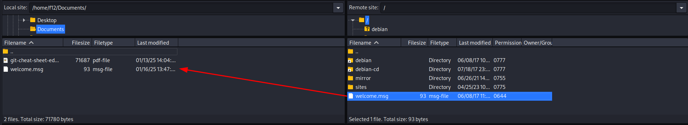

# README: Configuración de vsftpd.conf y vsftpd.conf.bak

Este archivo README explica las configuraciones de los archivos `vsftpd.conf` y `vsftpd.conf.bak` que son usados para configurar el servidor **vsftpd** (Very Secure FTP Daemon), un servidor FTP ligero y seguro. 

Aquí se describen las principales configuraciones y diferencias entre ambos archivos.

## 1. Archivo vsftpd.conf

Este archivo contiene una configuración personalizada y avanzada para un servidor FTP en el dominio `sistema.sol`.

### Principales configuraciones:

### 1. Modo de operación del servidor:
- `listen=YES`: Configura el servidor como independiente (standalone) y lo habilita para conexiones IPv4.
- `listen_ipv6=NO`: No habilita soporte para IPv6 en esta configuración.

### 2. Mensajes personalizados:
- `ftpd_banner="--- Welcome to the FTP server of 'sistema.sol' ---"`: Mensaje de bienvenida al conectarse.
- `dirmessage_enable=YES`: Activa mensajes personalizados en directorios (archivos `.message`).

### 3. Permitir usuarios anónimos y configuraciones:
- `anonymous_enable=YES`: Permite acceso anónimo.
- `anon_upload_enable=NO`: No permite a usuarios anónimos subir archivos.
- `anon_other_write_enable=NO`: No permite a usuarios anónimos realizar modificaciones (el acceso es solo de lectura).

### 4. Control de usuarios locales:
- `local_enable=YES`: Permite el acceso a usuarios locales.
- `write_enable=YES`: Permite a los usuarios locales subir y modificar archivos.
- `chroot_local_user=YES`: Enjaula a los usuarios locales en sus directorios personales.
- `chroot_list_enable=YES`: Excluye de la restricción a usuarios listados en `/etc/vsftpd.chroot_list`.

### 5. Restricciones de ancho de banda y conexiones:
- `local_max_rate=5242880`: Límite de velocidad para usuarios locales (5 MB/s).
- `anon_max_rate=2097152`: Límite de velocidad para usuarios anónimos (2 MB/s).
- `max_clients=15`: Máximo de 15 clientes conectados simultáneamente.

### 6. Tiempo de espera:
- `idle_session_timeout=720`: Cierra la sesión tras 720 segundos de inactividad.

### 7. Configuración de seguridad (FTPS):
- `ssl_enable=YES`: Habilita FTPS (FTP con SSL/TLS).
- `force_local_data_ssl=YES` y `force_local_logins_ssl=YES`: Obliga a que todas las conexiones locales sean cifradas.
- `rsa_cert_file` y `rsa_private_key_file`: Especifica los certificados SSL utilizados.


## 2. Archivo vsftpd.conf.bak

Este archivo representa una configuración de ejemplo predeterminada, más restrictiva y menos personalizada.

### Principales diferencias respecto a vsftpd.conf:

#### 1. Acceso anónimo:
- `anonymous_enable=NO`: No permite acceso anónimo.

#### 2. Conexión IPv6:
- `listen_ipv6=YES`: Escucha en direcciones IPv6, compatible con IPv4.

#### 3. Acceso de usuarios locales:
- `local_enable=YES`: Permite acceso local.
- `write_enable=NO` (comentado): No habilita comandos de escritura por defecto.

#### 4. Seguridad:
- `ssl_enable=NO`: No habilita conexiones seguras por defecto.
- Certificados predeterminados (`ssl-cert-snakeoil.pem`) en caso de habilitar SSL.

#### 5. Configuraciones adicionales:
- Configuración genérica y comentarios para funcionalidades como:
  - `anon_upload_enable`: Permitir carga de archivos anónimos.
  - `chroot_local_user`: Enjaular a usuarios locales.
  - `xferlog_enable=YES`: Registro de transferencias.
- Archivos comentados como ejemplo de personalización.

  ## 3. Uso y propósito de los archivos:

- **vsftpd.conf**: Archivo personalizado para un entorno productivo en el servidor de `sistema.sol`.
- **vsftpd.conf.bak**: Archivo de respaldo con configuraciones predeterminadas, útiles para entender las opciones básicas y como referencia para crear una configuración propia.

## 4. Cómo usar estos archivos:

### 1.Configurar `vsftpd.conf`:
1. Copiar el archivo en `/etc/vsftpd.conf`.
2. Ajustar las rutas de los certificados (`rsa_cert_file` y `rsa_private_key_file`) si difieren en tu sistema.
3. Crear o editar `/etc/vsftpd.chroot_list` para definir usuarios excluidos del enjaulamiento.

### 2.Revertir a `vsftpd.conf.bak`:
1. Usar este archivo como plantilla básica para restaurar una configuración mínima.
2. Renombrarlo como `vsftpd.conf` y adaptarlo según sea necesario.

5. Recomendaciones de seguridad:
Usar FTPS siempre que sea posible (ssl_enable=YES).
Limitar el acceso anónimo a solo lectura o deshabilitarlo por completo.
Usar listas de control (chroot_list_enable=YES) para definir excepciones de acceso.

## 6. Comandos útiles:

### Iniciar/Detener/Restaurar el servicio:
```bash
sudo systemctl start vsftpd
sudo systemctl stop vsftpd
sudo systemctl restart vsftpd
```
### Verificar estado del servicio:

```bash
sudo systemctl status vsftpd
```
### Probar la conexión FTP:

```bash
ftp localhost


```
## Ejercicio 2.2
### 1. Verificar si pftp está instalado

### Comando para verificar si está instalado:
```bash
which pftp
```
- Si el comando muestra una ruta como `/usr/bin/pftp`, significa que está instalado.
- Si no está instalado, el comando no devolverá ningún resultado.

  ### Instalar pftp si no está instalado:

#### En sistemas basados en Debian/Ubuntu:
```bash
sudo apt update
sudo apt install ftp
```

## 2. Configurar el archivo `~/.netrc` para conexiones automáticas

1. **Crear o editar el archivo `~/.netrc`:**
   ```bash
   nano ~/.netrc
   ```

2. **Agregar la configuración de un servidor FTP:**

   Escribe en el archivo la siguiente estructura para cada servidor al que quieras conectarte:
   ```plaintext
   machine <nombre_del_servidor>
   login <usuario>
   password <contraseña>

   ```
 3. **Guardar y salir del archivo:**

   - En **nano**, presiona:
     - `Ctrl + O` para guardar los cambios.
     - Luego, presiona `Enter` para confirmar.
     - Finalmente, `Ctrl + X` para salir.

4. **Asegurar que el archivo tiene permisos restringidos (seguridad):**

   Ejecuta el siguiente comando para garantizar que solo el propietario pueda acceder al archivo:
   ```bash
   chmod 600 ~/.netrc

## 3. Probar la conexión automática

Después de configurar el archivo `~/.netrc`, puedes conectarte automáticamente al servidor sin ingresar credenciales manualmente.

### Usar pftp:
```bash
pftp tierra.sistema.sol


```
# ejericio 2.3
## 1. Establecer conexión anónima al servidor `ftp.cica.es` desde `tierra.sistema.sol`

Usa el comando `ftp` para conectarte de forma anónima:

```bash
ftp ftp.cica.es
```

## 2. Examinar el directorio actual en el servidor

Después de conectarte al servidor, utiliza el siguiente comando para ver el directorio actual:

```bash
pwd
```

## 3. Examinar el directorio actual en el cliente

Para ver el directorio actual del cliente (tu máquina local) mientras estás conectado al servidor FTP, usa:

```bash
!pwd
```

## 4. Listar los archivos en el servidor

Para ver los archivos y carpetas en el directorio actual del servidor FTP, utiliza:

```bash
ls
```
## 5. Listar los archivos en el cliente

Para listar los archivos en el directorio actual de tu máquina local (cliente) mientras estás conectado al servidor FTP, usa:

```bash
!ls
```

## 6. Descargar `/pub/check` del servidor al cliente

Usa el comando `get` para descargar un archivo desde el servidor FTP a tu máquina local:

```bash
cd /pub
get check
```

## 7. Crear el directorio imágenes en el cliente dentro de pruebasFTP  
Para crear un directorio en el cliente:

1. Sal de la sesión FTP temporalmente con !:

```bash
!mkdir -p pruebasFTP/imágenes

```
2. Confirma que se creó el directorio usando:

```bash
!ls pruebasFTP

```
## 8. Subir el archivo datos1.txt al servidor  
Asegúrate de que el archivo `datos1.txt` exista en el cliente. Luego, usa el comando `put` para subirlo al servidor:

```bash
put datos1.txt
```
## 9. Cerrar la conexión  
Para salir de la sesión FTP, usa:

```bash
bye
```


# Configuración de vsftpd

## Imágenes y pasos


---

### Paso 1

-  Conexión al servidor FTP con credenciales específicas.

---

### Paso 2

-  Uso de la terminal para conectarse al servidor FTP como usuario `luis` y listar los archivos disponibles.

---

### Paso 3

-  Conexión al servidor FTP como usuario `maria`, navegando entre directorios y listando carpetas.

---

### Paso 4

-  Conexión al servidor FTP en modo anónimo, mostrando acceso limitado a los directorios públicos.

# Uso de Cliente Gráfico para FTP
### Paso 1: Abrir FileZilla

-  Comando para instalar FileZilla en sistemas basados en Debian/Ubuntu. Usa el comando `sudo apt install filezilla`.

---

### Paso 2: Interfaz inicial de FileZilla

-  Interfaz inicial de FileZilla al abrir el programa. Aquí se pueden configurar los parámetros para conectar a un servidor FTP.

---

### Paso 3: Configuración de un nuevo sitio FTP

-  Creación de un nuevo sitio FTP en FileZilla, configurando el host (`ftp.rediris.es`), tipo de cifrado y acceso anónimo.

---

### Paso 4: Advertencia sobre conexión insegura

-  Al conectar al servidor, FileZilla muestra una advertencia sobre el uso de FTP sin cifrado (inseguro). Puedes continuar aceptando la conexión.

---

### Paso 5: Estado de la conexión al servidor

-  Verificación del estado de la conexión al servidor FTP (`ftp.rediris.es`), mostrando que se ha conectado exitosamente.

---

### Paso 6: Transferencia de archivos desde el cliente

-  Transferencia de un archivo (`welcome.msg`) desde el servidor FTP al cliente local.

---

### Paso 7: Exploración de los archivos en el cliente

-  Archivo transferido (`welcome.msg`) mostrado en el sistema de archivos local y abierto en un editor de texto.

---

### Paso 8: Navegación en los directorios del cliente y servidor

-  Vista comparativa de los directorios locales y remotos en FileZilla, destacando la transferencia completada.

---

### Paso 9: Servicios reiniciados en el sistema

-  Configuración del sistema mostrando los servicios a reiniciar tras una instalación o actualización.

---

### Paso 10: Resultado final

-  Proceso finalizado con éxito, mostrando que FileZilla está configurado y listo para gestionar conexiones FTP.

---

#Preguntas
Preguntas: Examina la ventana de los mensajes intercambiados y contesta: a. ¿Qué modo ha usado el cliente (activo o pasivo) al descargar el listado de archivos del servidor?

Filezilla por defecto utiliza el modo pasivo, lo que facilita el acceso a través de cortafuegos y routers NAT, ya que el cliente inicia la conexión tanto para los comandos como para la transferencia de datos, lo que generalmente funciona mejor en entornos restringidos.

b. ¿Cuál es la IP del servidor de ftp.rediris.es?

Como podemos ver en al imagen la 130.206.13.2

c. ¿De los 6 dígitos que aparecen en el mensaje 227 Entering Passive Mode (…) qué significan los 2 últimos números?

227 Entering Passive Mode (192,0,2,1,104,31) Los dos últimos números son los dos bytes que comprenden el puerto remoto para la conexión de datos pasiva.


